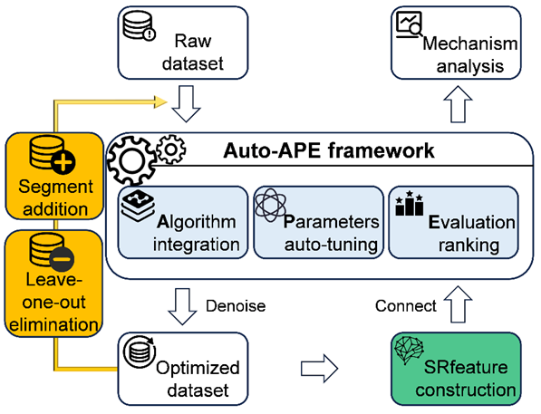

# Auto-APE
An Unbiased Automated Recommendation Framework for Machine Learning in Materials Science

The main part of the code includes the Auto-APE framework and the PySR feature generation module, and the specific applicable methods are referred to the published literature.

Abstract：Machine learning is attracting rising interest in the field of materials science. However, the algorithm-selection criteria are not clear, manual parameter adjustment introduces human bias, and single metric cannot evaluate various models well. To tackle these challenges, this paper introduces an Auto-APE framework that integrates various regression algorithms, automated tuning methods, and comprehensive evaluation metrics to recommend the optimal model. Based on this framework, the leave-one-out elimination and addition methods are integrated for data screening. Additional features are generated via symbolic regression to enhance the relationship between features and properties. Finally, this workflow is applied to the hardness prediction of Al-Co-Cr-Cu-Fe-Ni high entropy alloys. The 10-fold CV RSME of the best model is reduced by 32% after data screening and an additional 7% after features addition. The optimal single-run RMSE result can reach around 7. This Auto-APE framework can provide unbiased modeling and evaluating strategy to accelerate the application of machine learning in material design.

Key words： Machine learning, Data augmentation, Feature engineering, Symbolic regression, High-entropy alloys

Highlights：
1.	An Auto-APE framework is used to unbiasedly recommend models

2.	Optimize datasets with leave-one-out elimination and addition

3.	symbolic regression features bridge component-hardness relationships
